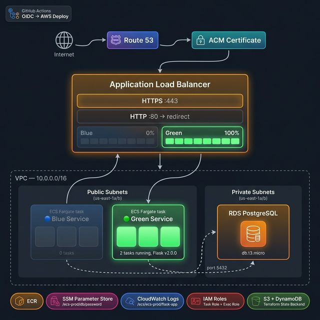

# ECS Production Platform

> **A production-grade container platform built on AWS ECS Fargate with blue-green deployments, RDS PostgreSQL, and full infrastructure-as-code via Terraform.**

Sprint-deployed portfolio project demonstrating real-world cloud engineering: zero-downtime deployments, network isolation, secrets management, and cost-controlled infrastructure. Total AWS cost: **~$0.50** for a 4-hour live validation window.



---

## Quick Navigation

| Section | Link |
|---|---|
| Architecture | [↓ below](#architecture) |
| Deployment Guide | [docs/runbooks/00-complete-deployment-guide.md](docs/runbooks/00-complete-deployment-guide.md) |
| Blue-Green Runbook | [docs/runbooks/rollback-procedure.md](docs/runbooks/rollback-procedure.md) |
| Lessons Learned | [docs/02_LESSONS_LEARNED.md](docs/02_LESSONS_LEARNED.md) |
| Cost Analysis | [docs/03_COST_ANALYSIS.md](docs/03_COST_ANALYSIS.md) |
| Security Design | [docs/04_SECURITY.md](docs/04_SECURITY.md) |
| CI/CD Design | [docs/05_CICD_DESIGN.md](docs/05_CICD_DESIGN.md) |
| Live Evidence | [docs/evidence/](docs/evidence/) |
| Dev.to Article | *(link after publishing)* |

---

## Architecture

```
Internet
    │
    ▼
Route 53 (app.cipherpol.xyz)
    │
    ▼
ACM Certificate (TLS 1.2/1.3)
    │
    ▼
Application Load Balancer (ecs-prod-alb)
    │   Port 80 → 443 redirect
    │   Port 443 → weighted forward
    │
    ├──── Blue Target Group (ecs-prod-blue)
    │         │
    │         ▼
    │     ECS Fargate Service (ecs-prod-service)
    │     2 tasks × Flask/Gunicorn on port 8000
    │
    └──── Green Target Group (ecs-prod-green)
              │
              ▼
          ECS Fargate Service (ecs-prod-service-green)
          Weight: 100% during green deployment

Both services connect to:
    │
    ▼
RDS PostgreSQL 15.12 (private subnet, port 5432)
DB credentials stored in SSM Parameter Store
```

**VPC Design:**
- `10.0.0.0/16` CIDR with 4 subnets across 2 AZs
- Public subnets: ECS tasks (ALB-filtered ingress), ALB
- Private subnets: RDS only (no internet route)
- Security groups enforce least-privilege isolation

---

## Technology Stack

| Layer | Technology | Notes |
|---|---|---|
| Infrastructure as Code | Terraform 1.14+ | Modular design, remote state in S3 |
| Container Platform | AWS ECS Fargate | Serverless containers, no EC2 management |
| Load Balancing | AWS ALB | Blue-green switching via target group weights |
| Database | RDS PostgreSQL 15.12 | Private subnet, SSM-managed credentials |
| TLS/DNS | ACM + Route 53 | Auto-renewing cert, A record alias |
| Container Registry | Amazon ECR | Tagged versioned images |
| Secrets | AWS SSM Parameter Store | SecureString, no hardcoded credentials |
| Monitoring | CloudWatch Logs | Log group per service |
| Application | Flask 3.0 + Gunicorn | Python WSGI app in multi-stage Docker image |

---

## Repository Structure

```
ecs-production-platform/
├── README.md
├── app/
│   ├── Dockerfile                     ← Multi-stage build
│   ├── requirements.txt
│   └── src/
│       ├── app.py                     ← Flask API (health, items, db-check)
│       ├── models.py                  ← PostgreSQL connection + queries
│       └── config.py                  ← Environment-based config
├── .github/
│   └── workflows/
│       ├── deploy.yml                 ← Build image, push to ECR, deploy green
│       └── rollback.yml               ← Switch ALB to blue, scale green down
├── terraform/
│   ├── modules/
│   │   ├── networking/                ← VPC, subnets, IGW, route tables, SGs
│   │   ├── iam/                       ← ECS task execution + task roles
│   │   ├── alb/                       ← ALB, listeners, blue/green target groups
│   │   ├── ecs/                       ← Cluster, task definitions, services
│   │   ├── rds/                       ← PostgreSQL instance, subnet group
│   │   └── cicd/                      ← OIDC provider + GitHub Actions IAM role
│   └── environments/
│       └── prod/
│           ├── main.tf                ← Module composition
│           ├── variable.tf
│           ├── outputs.tf
│           ├── backend.tf             ← S3 + DynamoDB remote state
│           └── versions.tf
├── docs/
│   ├── ARCHITECTURE.md
│   ├── 01_IMPLEMENTATION.md          ← Phase-by-phase build log
│   ├── 02_LESSONS_LEARNED.md         ← Issues encountered and fixes
│   ├── 03_COST_ANALYSIS.md
│   ├── 04_SECURITY.md                ← IAM, network, secrets design
│   ├── 05_CICD_DESIGN.md             ← Pipeline design and OIDC setup
│   ├── evidence/                     ← Live deployment JSON captures + screenshots
│   └── runbooks/
│       ├── 00-complete-deployment-guide.md  ← Start here to replicate
│       ├── rollback-procedure.md
│       ├── deployment-failure.md
│       └── database-connection.md
└── scripts/
    ├── capture-evidence.sh           ← Infrastructure state snapshot
    ├── test-blue-green.sh            ← Full blue-green switch + verification
    ├── test-deployment.sh            ← Endpoint smoke tests
    └── verify-cleanup.sh             ← Post-destroy resource check
```

---

## Blue-Green Deployment

This platform implements zero-downtime blue-green deployments using **ALB weighted target groups**.

### How It Works

```
Normal state:  Blue TG weight=100, Green TG weight=0
Deploy green:  Green TG weight=100, Blue TG weight=0  ← instant switch (<1s)
Rollback:      Blue TG weight=100, Green TG weight=0  ← same command, reversed
```

📸 [View live deployment screenshots →](docs/evidence/screenshots/)


### Switch Traffic to Green

```bash
export MSYS_NO_PATHCONV=1   # Windows Git Bash only

aws elbv2 modify-listener \
  --listener-arn <HTTPS_LISTENER_ARN> \
  --default-actions '[{"Type":"forward","ForwardConfig":{"TargetGroups":[
    {"TargetGroupArn":"<GREEN_TG_ARN>","Weight":100},
    {"TargetGroupArn":"<BLUE_TG_ARN>","Weight":0}
  ]}}]' \
  --region us-east-1
```

Rollback is the same command with weights reversed. See [rollback runbook](docs/runbooks/rollback-procedure.md).

---

## Evidence

The full deployment was captured before teardown:

- 📸 [AWS Console screenshots](docs/evidence/screenshots/) — VPC, subnets, security groups, ECS cluster, ALB listener weights, target group health, RDS, CloudWatch logs
- 📄 [JSON captures](docs/evidence/) — 24 files: VPC state, IAM roles, ECS services, ALB config, target group health, live API responses, Terraform outputs

---

## Deploying This Project

> See the complete step-by-step guide: **[docs/runbooks/00-complete-deployment-guide.md](docs/runbooks/00-complete-deployment-guide.md)**

Quick summary:

```bash
# 1. Bootstrap (one-time): S3 bucket, DynamoDB table, ECR repo, SSM password

# 2. Build and push the app image
cd app && docker build -t $ECR_REPO:v1.0.0 . && docker push $ECR_REPO:v1.0.0

# 3. Deploy infrastructure
cd terraform/environments/prod
export TF_VAR_db_password="your-password"
terraform init && terraform apply

# 4. Verify
curl https://app.cipherpol.xyz/health
# {"status": "healthy", "version": "1.0.0", "deployment": "blue"}

# 5. Destroy when done
aws ecs update-service --cluster ecs-prod-cluster --service ecs-prod-service --desired-count 0
aws ecs update-service --cluster ecs-prod-cluster --service ecs-prod-service-green --desired-count 0
sleep 60 && terraform destroy
```

---

## Application API

| Endpoint | Method | Description |
|---|---|---|
| `GET /` | GET | Service info — version, deployment slot |
| `GET /health` | GET | ALB health check target |
| `GET /db-check` | GET | PostgreSQL connectivity test |
| `GET /items` | GET | List all items in DB |
| `POST /items` | POST | Create item `{"name": "..."}` |

---

## CI/CD Pipeline

Two GitHub Actions workflows are in `.github/workflows/`:

| Workflow | Trigger | What It Does |
|---|---|---|
| `deploy.yml` | Push to `main` | Build image → push to ECR → deploy to green ECS service |
| `rollback.yml` | Manual trigger | Switch ALB to blue, scale green to 0 |

Authentication uses **OIDC** — no long-lived AWS credentials stored in GitHub. See [docs/05_CICD_DESIGN.md](docs/05_CICD_DESIGN.md) for setup.

---

## Cost

| Service | Rate | 24-hour cost |
|---|---|---|
| ALB | $0.0225/hr | $0.54 |
| ECS Fargate (2 tasks) | $0.025/hr | $0.59 |
| RDS db.t3.micro | $0.017/hr | $0.41 |
| RDS Storage (20 GB) | prorated | $0.08 |
| Route 53 | prorated | $0.02 |
| **Total** | | **~$1.64/day** |

**4-hour validation session: ~$0.50**

No NAT Gateway = single biggest cost saving ($33/month avoided). See [docs/03_COST_ANALYSIS.md](docs/03_COST_ANALYSIS.md).

---

## Author

**Suleiman** — Cloud Infrastructure Engineer  
[github.com/cypher682](https://github.com/cypher682)
